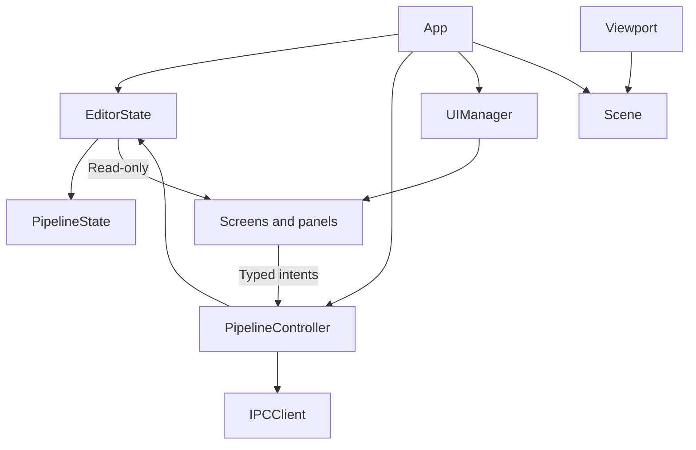
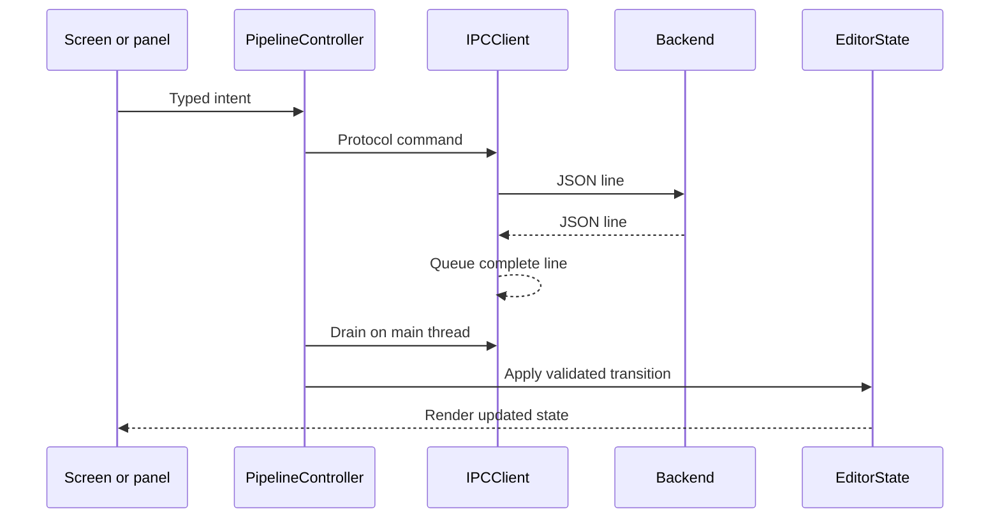

# Editor Architecture

This document defines the target internal architecture of the AnitoScan C++ editor.

Related contracts:

- Backend and run state transitions: [`editor_backend_integration.md`](editor_backend_integration.md)
- UI presentation: [`ui_workflow.md`](ui_workflow.md)
- Wire messages: [`ipc_protocol.md`](ipc_protocol.md)

## Architecture overview



The editor separates state, application control, backend transport, UI presentation, and scene rendering.

## Components

| Component | Responsibility |
|---|---|
| `App` | Composition root, component lifetime, main loop, and cross-subsystem event dispatch. |
| `EditorState` | Authoritative non-render editor data. |
| `PipelineState` | Backend, run, phase, progress, log, error, action, workspace, and output state. |
| `PipelineController` | High-level pipeline commands, backend event decoding, state transitions, and backend restart policy. |
| `IPCClient` | Platform-neutral process, pipe, framing, send, receive, and transport-failure mechanics. |
| `UIManager` | Persistent layout, active-screen composition, dialogs, and intent collection. |
| Screens and panels | Read-only state presentation and typed user intents. |
| `Scene` | Model, material, and render-resource ownership. |
| Viewport | Scene presentation and viewport-specific interaction. |

Detailed backend and run state transitions belong only in [`editor_backend_in
tegration.md`](editor_backend_integration.md).

## `App` and ownership

`App` owns the long-lived editor components:

```text
App
  EditorState
  IPCClient
  PipelineController
  UIManager
  Scene
```

It constructs and connects them, coordinates shutdown, and dispatches typed events between otherwise independent subsystems. It does not parse backend fields or implement pipeline state transitions.

References between components are non-owning unless ownership is explicit.

A frame follows this order:

```text
Process platform input
  -> ask controllers to drain external events
  -> apply state transitions
  -> dispatch cross-subsystem events
  -> render UI and scene
  -> present frame
```

## State ownership

`EditorState` contains data only. It does not contain process handles, transport objects, or GPU resources.

A typical composition is:

```text
EditorState
  PipelineState
  configuration draft
  pre-run setup step
  editor notifications
```

`PipelineState` is the sole editor-side source for backend status, run status, current phase, progress, logs, errors, pending actions, and generated artifact paths.

Workflow presentation derives its active phase screen from `PipelineState`; it does not copy phase or run status into a separate workflow model. Only pre-run navigation such as Input versus Confirmation requires independent setup state.

Controllers mutate state on the main thread. UI components receive read-only state. Local presentation details, such as an open menu or text-field focus, may remain inside a UI component.

## `PipelineController`

`PipelineController` exposes application-level operations such as:

```text
StartBackend()
StopBackend()
StartRun(configuration)
CancelRun()
SubmitSelection(requestId, choice)
```

It validates intents against current state, sends protocol commands through `IPCClient`, decodes queued backend events, and applies the state transitions defined in [`editor_backend_integration.md`](editor_backend_integration.md).

It may publish typed application events, such as output availability, when another subsystem must react. It never directly mutates panels or OpenGL resources.

## `IPCClient`

`IPCClient` owns only process and transport mechanics:

- backend launch and termination;
- standard-stream pipes;
- complete-line framing;
- ordered send and receive;
- a thread-safe receive queue;
- process and transport failure reporting;
- process-resource cleanup.

It does not interpret pipeline semantics, mutate application state, call UI components, or load scene resources.

### Platform boundary

The public interface is platform-neutral. Platform process details remain in implementation-specific sources, for example:

```text
src/editor/
  IPCClient.h
  IPCClientWin32.cpp
  IPCClientPosix.cpp
```

Win32 or POSIX handles and APIs do not leak into controllers, state, UI, or rendering code.

## UI boundary

`UIManager` composes the layout and passes read-only state to screens and panels.

Screens and panels:

- render state;
- collect and validate presentation-level input;
- emit typed intents such as `StartRunRequested`, `CancelRunRequested`, and `SelectionSubmitted`.

They do not send raw IPC, manage backend processes, parse backend messages, perform pipeline state transitions, construct generated paths, or mutate other panels.

The visible workflow is defined in [`ui_workflow.md`](ui_workflow.md).

## Command and event flow



Backend events never mutate UI objects directly.

## Threading

The IPC reader thread may block on backend output, frame complete lines, and enqueue them. It does not mutate `EditorState`, call ImGui, touch OpenGL resources, invoke UI components, or modify the scene.

The main thread owns:

- controller state transitions;
- `EditorState` mutation;
- workflow navigation;
- ImGui rendering;
- scene mutation;
- OpenGL resource creation and destruction.

This gives application state and rendering resources one clear thread owner.

## Scene and viewport

`Scene` loads and owns model, material, and rendering resources. The viewport renders the scene and handles camera or viewport interaction; it does not parse backend events or derive output paths.

When a run completes:

1. `PipelineController` stores the reported output in `PipelineState`.
2. It publishes a typed output-available event.
3. `App` dispatches that event to `Scene` on the main thread.
4. The viewport renders the updated scene.

## Shutdown

Shutdown proceeds in ownership order:

1. stop accepting UI commands;
2. resolve any active run according to integration policy;
3. stop the backend process and IPC reader;
4. release UI and scene resources;
5. destroy the rendering context.

## Dependency rules

```text
UI -> read-only EditorState and controller interfaces
PipelineController -> EditorState, IPCClient, protocol definitions
IPCClient -> platform process implementation
Viewport -> Scene and rendering abstractions
```

Disallowed dependencies include:

```text
IPCClient -> UI or Scene
Scene -> IPCClient
Panels -> raw protocol or process APIs
Background threads -> EditorState, UI, Scene, or OpenGL
```

## Architecture invariants

1. `App` is the composition root and main-loop owner.
2. `EditorState` is the authoritative editor-side data source.
3. Controllers perform application state transitions on the main thread.
4. UI components render state and emit typed intents.
5. `IPCClient` owns transport and process mechanics only.
6. Platform-specific process types do not escape `IPCClient`.
7. Background threads do not mutate application or rendering state.
8. Backend events never directly mutate panels or viewport resources.
