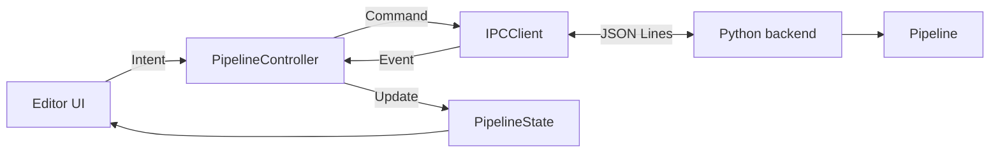
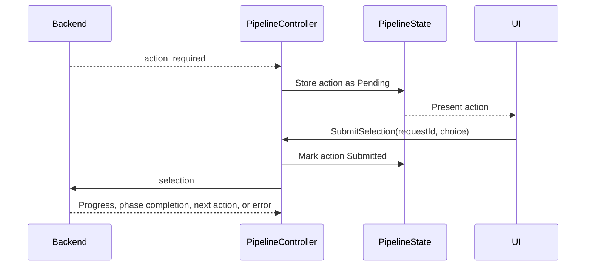

# Editor–Backend Integration

This document defines how editor intents and backend events change editor-side backend and run state.

Related contracts:

- Message schemas and sequencing: [`ipc_protocol.md`](ipc_protocol.md)
- Editor component ownership: [`editor_architecture.md`](editor_architecture.md)
- Artifact locations: [`filesystem_layout.md`](filesystem_layout.md)
- Visible workflow: [`ui_workflow.md`](ui_workflow.md)

## System boundary

The editor and backend are separate processes. The editor sends high-level pipeline commands through `PipelineController`; the backend validates them, executes the pipeline, and reports authoritative lifecycle events.

The editor never calls Python phase modules directly.



## State model

Backend and run lifecycles are represented separately. A backend may remain ready after a run reaches a terminal state.

### Backend state

| State | Meaning |
|---|---|
| `Stopped` | No backend process exists. |
| `Starting` | The process exists but has not sent `backend_ready`. |
| `Ready` | The process supports the required protocol and accepts commands. |
| `Stopping` | Normal process shutdown is in progress. |
| `Failed` | Startup, transport, protocol compatibility, or process execution failed. |

### Run state

| State | Meaning |
|---|---|
| `Idle` | No run is active. |
| `Starting` | `run_pipeline` was sent and acceptance is pending. |
| `Running` | A pipeline phase is active. |
| `AwaitingAction` | The backend is waiting for an interactive response. |
| `Cancelling` | Cancellation was requested and is pending. |
| `Completed` | The backend sent `done`. |
| `Cancelled` | The backend sent `cancelled`. |
| `Failed` | A run- or backend-scoped failure terminated the run. |

Active run states are `Starting`, `Running`, `AwaitingAction`, and `Cancelling`. Only one run may be active.

## Backend lifecycle

| Trigger | Required prior state | Result |
|---|---|---|
| Start backend intent | `Stopped` or `Failed` | Launch process; state becomes `Starting`. |
| Compatible `backend_ready` | `Starting` | State becomes `Ready`. |
| Unsupported protocol version | `Starting` | Stop process; state becomes `Failed`. |
| Stop backend intent | `Ready` with no active run | State becomes `Stopping`, then `Stopped` after process exit. |
| Expected process exit | `Stopping` | State becomes `Stopped`. |
| Unexpected process or transport failure | Any live state | State becomes `Failed`; any active run becomes `Failed`. |

Process creation alone does not make the backend ready. Commands are not sent until a compatible `backend_ready` is received.

Backend restart policy is centralized in `PipelineController`. UI components never restart the process directly.

## Starting a run

A run may start only when:

- backend state is `Ready`;
- no run is active;
- the editor has a complete proposed configuration;
- no interactive action is pending.

Editor-side checks provide immediate feedback. Backend validation remains authoritative.

```mermaid
sequenceDiagram
    participant UI
    participant Controller as PipelineController
    participant Backend
    participant State as PipelineState

    UI->>Controller: StartRun(configuration)
    Controller->>State: Run = Starting
    Controller->>Backend: run_pipeline
    Backend-->>Controller: workspace_ready
    Controller->>State: Store accepted run and workspace
    Backend-->>Controller: phase_started
    Controller->>State: Run = Running; set phase
```

A command-scoped error that rejects `run_pipeline` returns the run to `Idle` and preserves the error for display.

## Backend event mapping

The controller applies backend events on the editor main thread.

| Backend event | State change |
|---|---|
| `log` | Append the entry without changing lifecycle state. |
| `workspace_ready` | Store accepted run name and workspace. |
| `phase_started` | Set current phase, reset phase progress, and set run to `Running`. |
| `progress` | Update phase and overall progress. |
| `action_required` | Store the pending action and set run to `AwaitingAction`. |
| `phase_completed` | Mark the phase complete. |
| `done` | Store output information, clear pending action, and set run to `Completed`. |
| `cancelled` | Clear pending action and set run to `Cancelled`. |
| Command-scoped `error` | Reject the related command without terminating an accepted run. |
| Run-scoped `error` | Clear pending action and set run to `Failed`. |
| Backend-scoped `error` | Set backend and any active run to `Failed`. |

Message field definitions remain exclusively in [`ipc_protocol.md`](ipc_protocol.md).

## Interactive actions

`PipelineState` stores one pending action with:

- request ID;
- action type;
- phase;
- associated artifact references;
- candidate information;
- submission status.

Submission status is either `Pending` or `Submitted`.



A selection is sent only when its request ID matches the pending action and its submission status is `Pending`.

Sending a selection does not immediately clear the action or set the run to `Running`. The action remains `Submitted` until an authoritative backend event resolves it:

- `progress`, `phase_started`, or `phase_completed` clears it and returns the run to `Running`;
- a new `action_required` replaces it;
- a matching command-scoped `error` returns it to `Pending` so the user may retry;
- `done`, `cancelled`, or a terminal error clears it.

This prevents duplicate responses without assuming backend acceptance.

## Cancellation

Cancellation is graceful by default.

1. The UI emits a cancel intent.
2. The controller sends `cancel_pipeline` and sets run state to `Cancelling`.
3. No new run or interactive response is accepted while cancellation is pending.
4. `cancelled` sets the run to `Cancelled`.
5. A terminal `error` sets the run to `Failed`.

If the cancellation command itself receives a command-scoped error, the controller restores the prior active run state and presents the error.

Forced process termination is reserved for an unresponsive backend. It is recorded as a backend failure rather than successful cancellation.

## Completion and artifacts

A run completes only after `done`. Progress, log text, animation state, and file appearance do not imply completion.

The controller stores workspace, preview, and output paths from backend events in `PipelineState`. Filesystem conventions are owned by [`filesystem_layout.md`](filesystem_layout.md).

A typed completion event may notify the scene subsystem that a new output is available; backend message handling does not mutate UI panels or rendering resources directly.

## Backend implementations

The production and dummy backends are interchangeable at this boundary. Backend selection changes process configuration only; commands, events, state transitions, and UI behavior remain identical.

## Integration invariants

1. Backend events are authoritative for backend and run lifecycle state.
2. Backend and run state are tracked independently.
3. At most one run and one interactive action are active at a time.
4. Logs and labels never drive state transitions.
5. Completion and cancellation require explicit terminal events.
6. An interactive action is not resolved merely because its response was sent.
7. Unexpected backend termination fails any active run.
