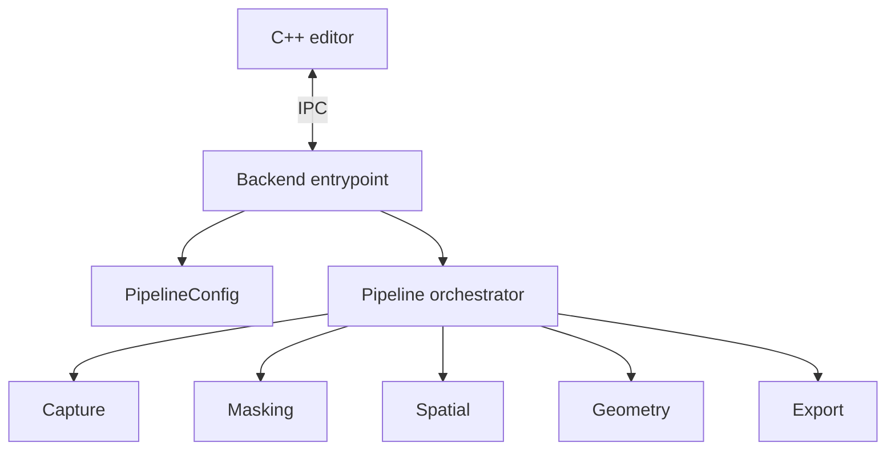
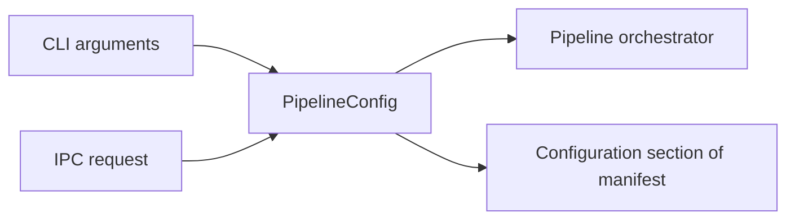

# Pipeline Architecture

This document defines the target architecture of the AnitoScan Python backend and reconstruction pipeline.

Related contracts:

- IPC messages: [`ipc_protocol.md`](ipc_protocol.md)
- Artifact layout: [`filesystem_layout.md`](filesystem_layout.md)

## Architecture overview

The backend receives commands and publishes events. The pipeline validates configuration and orchestrates reconstruction. Phase modules perform phase-specific work without depending on IPC or editor behavior.



## Platform support

| Component | Windows | macOS |
|---|---:|---:|
| C++ editor | Supported | Supported |
| IPC transport | Supported | Supported |
| Dummy backend | Supported | Supported |
| Production reconstruction backend | Supported | Not supported |
| 2DGS reconstruction | Supported | Not supported |

macOS uses the dummy backend for editor integration and workflow testing. Production reconstruction, CUDA behavior, and 2DGS output are validated on Windows.

The editor rejects production-backend launch requests on unsupported platforms rather than attempting to import or synchronize production dependencies.

## Target package structure

```text
src/pipeline/
  core/
    backend.py
    pipeline.py
    config.py
    ipc.py
    protocol.py
    dummy.py
  modules/
    capture.py
    remove_background.py
    spatial.py
    geometry.py
    export.py
```

## Core responsibilities

| File | Responsibility |
|---|---|
| `core/backend.py` | Production IPC entrypoint, command dispatch, cancellation requests, and translation between protocol messages and pipeline events. |
| `core/pipeline.py` | Workspace and manifest lifecycle, phase orchestration, artifact recording, and structured terminal results. |
| `core/config.py` | Configuration dataclasses, defaults, validation, quality presets, input normalization, and configuration serialization. |
| `core/ipc.py` | Newline-delimited JSON reading and writing only. |
| `core/protocol.py` | Python message constants, phase constants, constructors, and validators implementing `ipc_protocol.md`. |
| `core/dummy.py` | Lightweight protocol-compatible backend for editor development and integration tests. |

`backend.py` does not implement reconstruction phases. `ipc.py` does not own configuration, orchestration, or lifecycle policy.

## Configuration

`config.py` is the single source of pipeline defaults and validation.

```text
PipelineConfig
  CaptureConfig
  MaskingConfig
  SpatialConfig
  GeometryConfig
  ExportConfig
```

Both command-line and IPC inputs are normalized into the same validated `PipelineConfig`:



Configuration rules:

1. Defaults and quality presets are resolved once in `config.py`.
2. Validation completes before workspace creation or phase execution.
3. Phases receive explicit phase-specific configuration.
4. Phase modules do not define competing application-level defaults.
5. `config.py` serializes normalized configuration; `pipeline.py` owns the complete manifest.

CLI and IPC execution call the same orchestration API. A phase does not know how the run was launched.

## Pipeline context

The orchestrator creates one context per accepted run containing:

- validated configuration;
- run identity and workspace paths;
- progress and log reporting interfaces;
- interactive action interface;
- cancellation signal;
- artifact registry;
- orchestrator-managed manifest access.

Phase modules receive only the context capabilities they require. They do not import backend process or editor state.

## Execution

The pipeline executes phases in this order:

```text
Capture -> Masking -> Spatial -> Geometry -> Export
```

For each phase, the orchestrator:

1. checks cancellation;
2. reports phase start;
3. invokes the module with validated inputs;
4. receives structured outputs;
5. records state and artifacts in the manifest;
6. reports phase completion;
7. passes declared outputs to the next phase.

After export, the orchestrator returns a structured result containing the run name, workspace, primary output, and supporting artifact references.

## Phase contract

A phase module:

- reads only declared inputs;
- writes only to its assigned artifact location;
- reports normalized progress through an injected interface;
- checks cancellation at safe points;
- requests interaction through an injected interface;
- returns structured outputs;
- raises structured pipeline errors when it cannot continue.

A phase module does not parse CLI arguments, read editor commands, send raw IPC, edit another phase's artifacts, or control editor workflow.

## Phase ownership

| Phase | Module | Responsibility |
|---|---|---|
| Capture | `modules/capture.py` | Extract, select, and prepare source frames. |
| Masking | `modules/remove_background.py` | Segment subjects, produce masks and previews, and request candidate selection when needed. |
| Spatial | `modules/spatial.py` | Estimate cameras, poses, spatial relationships, and scene initialization. |
| Geometry | `modules/geometry.py` | Perform reconstruction or training from spatial outputs. |
| Export | `modules/export.py` | Produce the primary model and supporting artifacts. |

Spatial initialization belongs entirely to `spatial.py`. `geometry.py` consumes spatial outputs instead of recomputing camera, pose, or scene initialization.

Artifact locations are defined only in [`filesystem_layout.md`](filesystem_layout.md).

## Reporting and interaction

Phases publish internal pipeline events through injected interfaces. The backend adapts those events to IPC, while a CLI adapter may render them in a terminal.

The reporting interface supports:

- progress;
- human-readable logs;
- artifact registration.

The interaction interface supports:

- issuing a correlated action request;
- waiting for its response;
- observing cancellation while waiting.

This keeps phase modules independent of transport and presentation.

## Manifest

The pipeline orchestrator creates and updates the manifest at defined lifecycle boundaries. Phase modules return artifact and status information rather than editing the manifest directly.

The manifest records normalized configuration, phase state, artifact references, and the terminal result. Its location and purpose are defined in [`filesystem_layout.md`](filesystem_layout.md).

## Cancellation and errors

The backend sets a run-scoped cancellation signal when cancellation is accepted. The orchestrator and phases check it before phases, during long operations, while awaiting interaction, and before completion.

Cancellation unwinds to a distinct cancelled result. It is not represented as success or a generic failure.

Phase failures use structured exceptions or result types containing a stable code, description, and related phase or request when applicable. The orchestrator records the failure, preserves completed artifacts, skips subsequent phases, and returns a failed result. The backend alone translates terminal results into protocol messages.

## Dependency rules

```text
backend entrypoint
  -> protocol and IPC helpers
  -> configuration
  -> pipeline orchestrator
  -> phase modules
```

Phase modules may depend on shared pipeline data types but never on the editor, backend process management, IPC transport, UI concepts, or command-line parsing.

## Architecture invariants

1. Backend command handling and pipeline orchestration are separate responsibilities.
2. `config.py` is the single source of defaults and validation.
3. CLI and IPC execute the same validated orchestration path.
4. The orchestrator owns workspace, manifest, and phase lifecycle.
5. Phase modules do not send IPC or edit the manifest directly.
6. Spatial initialization belongs to the spatial phase.
7. Every accepted run returns one structured terminal result.
8. Production and dummy backends implement the same external contract.
