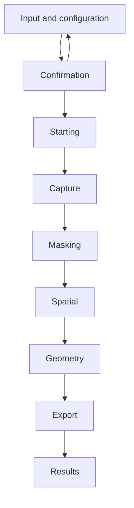

# UI Workflow

This document defines the target user workflow of the AnitoScan editor.

Related contracts:

- Editor state and components: [`editor_architecture.md`](editor_architecture.md)
- Backend and run state transitions: [`editor_backend_integration.md`](editor_backend_integration.md)
- Artifact layout: [`filesystem_layout.md`](filesystem_layout.md)

## Layout

The editor presents one primary workflow screen at a time:

```text
Persistent run header
Main workflow content
Optional logs and details
```

### Persistent header

The header displays state shared across screens:

- run name;
- backend and run status;
- current phase;
- overall progress;
- context-appropriate controls.

It reads these values from `PipelineState` rather than maintaining UI-local copies.

### Main content

The main area displays one of:

- Input and configuration;
- Confirmation;
- Starting;
- Capture;
- Masking;
- Spatial;
- Geometry;
- Export;
- Results.

Logs and technical details may appear in a collapsible secondary region without displacing the primary workflow.

## Screen selection

Pre-run setup uses a small local setup state for Input versus Confirmation. Once a run starts, the active screen is derived from `PipelineState`:

| State | Primary screen |
|---|---|
| No active run, setup step `Input` | Input and configuration |
| No active run, setup step `Confirm` | Confirmation |
| Run `Starting` | Starting |
| Run `Running`, Capture phase | Capture |
| Run `Running`, Masking phase | Masking |
| Run `Running`, Spatial phase | Spatial |
| Run `Running`, Geometry phase | Geometry |
| Run `Running`, Export phase | Export |
| Run `AwaitingAction` | Current phase, focused on the pending action |
| Run `Cancelling` | Current phase with cancelling status |
| Run `Completed` | Results |
| Run `Cancelled` or `Failed` | Last relevant screen with terminal status and recovery actions |

The workflow does not maintain a second copy of current phase or run status.



Transitions during a run follow the authoritative state changes defined in [`editor_backend_integration.md`](editor_backend_integration.md), not timers, animations, logs, or file appearance.

## Screen responsibilities

| Screen | Presents | User intents |
|---|---|---|
| Input | Input source, run name, quality, and exposed pipeline settings. | Continue to confirmation. |
| Confirmation | Complete proposed configuration and warnings. | Start run or return to editing. |
| Starting | Startup status and available logs. | Cancel when supported. |
| Capture | Capture progress, frame counts, and frame previews. | Cancel or inspect available artifacts. |
| Masking | Mask progress, previews, and pending candidate selection. | Select, skip, cancel, or inspect. |
| Spatial | Camera, pose, and scene-initialization progress. | Cancel or inspect status. |
| Geometry | Reconstruction progress, metrics, and available previews. | Cancel or inspect status. |
| Export | Export progress and output status. | Cancel or inspect status. |
| Results | Final model, run summary, and output information. | Inspect output or begin another run. |

Exact artifact locations and names remain defined only in [`filesystem_layout.md`](filesystem_layout.md).

## Input and confirmation

The Input screen performs presentation-level validation for immediate feedback. Authoritative defaults and validation belong to the pipeline configuration model.

The user proceeds to Confirmation before starting a run. Confirmation presents the complete proposed configuration, including resolved quality and phase-specific settings, and offers explicit Start and Edit actions.

After Start is accepted, the configuration is locked for that run.

## Phase screens

Every phase screen receives read-only editor state and may present:

- phase and overall progress;
- display-only status text;
- phase-specific metrics;
- available artifacts;
- warnings or errors;
- valid user actions.

Screens emit typed intents. They do not send IPC, perform lifecycle transitions, manage the backend process, or derive generated paths.

A progress value of `1.0` does not navigate to another screen. Navigation changes only when the underlying run or phase state changes.

## Masking interaction

When a pending masking action exists, the Masking screen:

1. displays the preview referenced by the action;
2. presents the available candidates and Skip;
3. submits the choice with the action's request ID;
4. disables further submissions while its status is `Submitted`;
5. waits for the controller to resolve or reopen the action.

When no action is pending, candidate controls are hidden or disabled. The workflow returns focus to Masking whenever user input is required there.

## Results

Results is entered only when run state is `Completed`.

It presents:

- the final model viewport;
- run and configuration summary;
- reported output information;
- available supporting artifacts;
- an action to begin another run.

The viewport consumes the output selected by editor state. Artifact path semantics remain defined by the protocol and filesystem contracts.

## Persistent controls

| Control | Availability | Behavior |
|---|---|---|
| Start | Backend ready, no active run, valid Confirmation screen | Emits a start-run intent. |
| Cancel | Run starting, running, or awaiting action | Requests graceful cancellation and remains pending until resolved. |
| Stop backend | No active run, or explicit emergency confirmation | Requests process shutdown; forced stop during a run is a failure. |
| Edit | Confirmation before a run | Returns to Input without changing backend state. |
| New run | Completed, cancelled, or failed when backend state permits | Returns to Input with a new configuration draft. |

Controls emit intents and never manage IPC or processes directly.

## Cancellation and errors

While cancellation is pending, the current phase remains visible, interactive controls are disabled, and logs and workspace context remain available.

A failure retains the last relevant screen and presents:

- error code and description;
- affected phase when available;
- relevant logs and workspace context;
- recovery actions valid for the current backend state.

The UI does not automatically restart the backend. Partial artifacts are never presented as a successful result.

## Navigation

Completed-phase information may be inspectable when supported, but manual navigation does not alter pipeline state, restart a phase, mark work complete, or bypass a pending action.

The active phase remains the default primary screen during a run.

## Workflow invariants

1. One primary workflow screen is active at a time.
2. Persistent run status remains visible.
3. A run starts only after explicit confirmation.
4. Run and phase state determine screens without duplicated workflow state.
5. UI labels, animations, and file appearance never drive transitions.
6. Interactive responses correlate to the active request and cannot be duplicated.
7. Results appear only for a completed run.
8. UI controls emit typed intents rather than managing backend communication.
